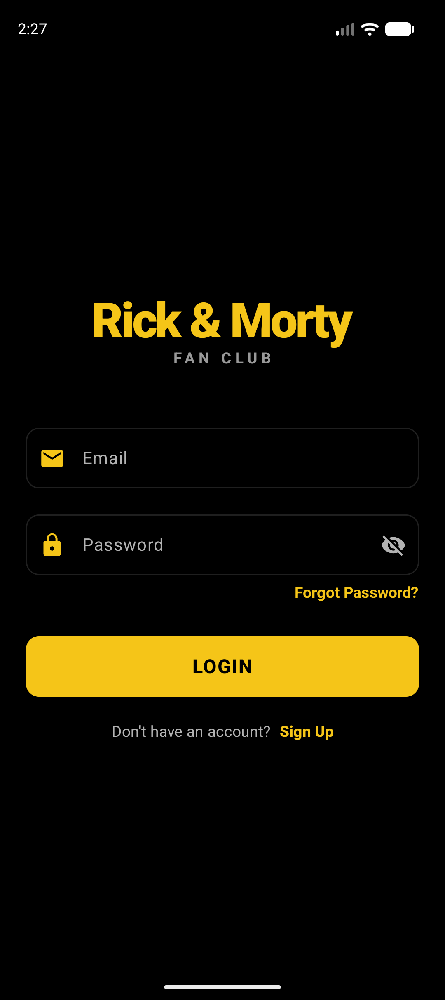
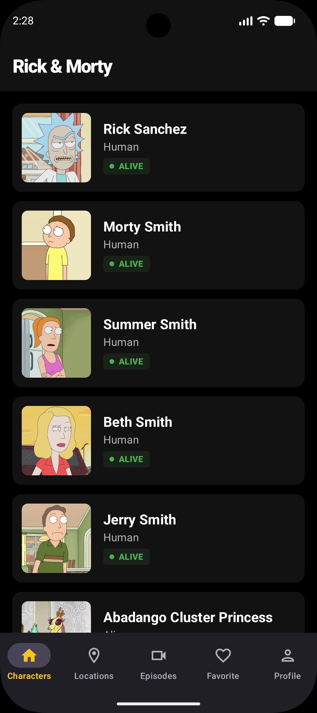
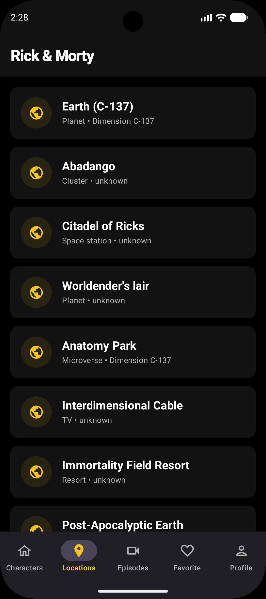
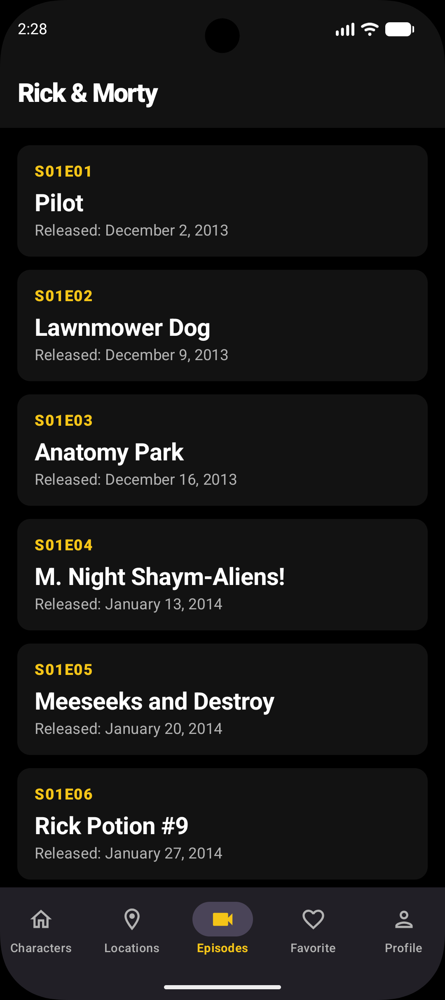
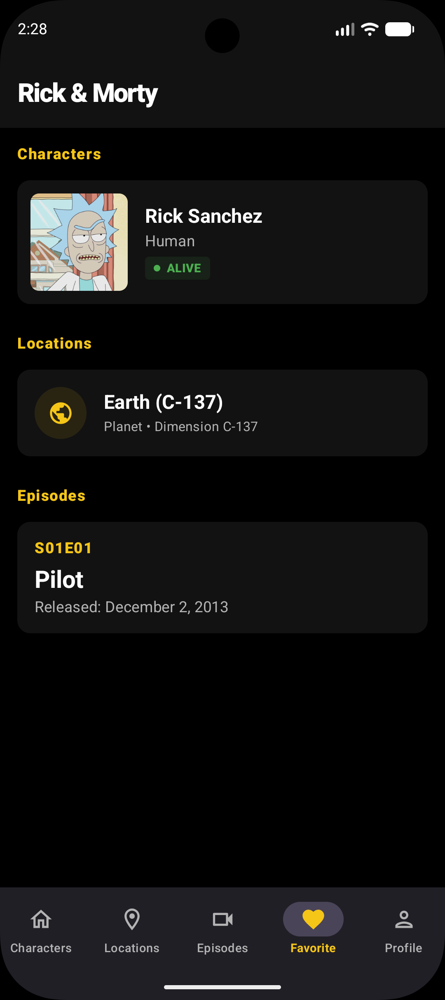
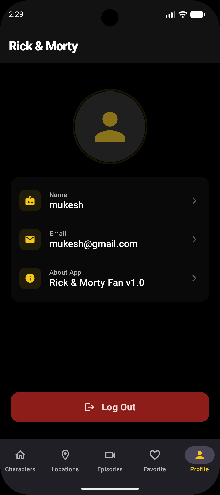
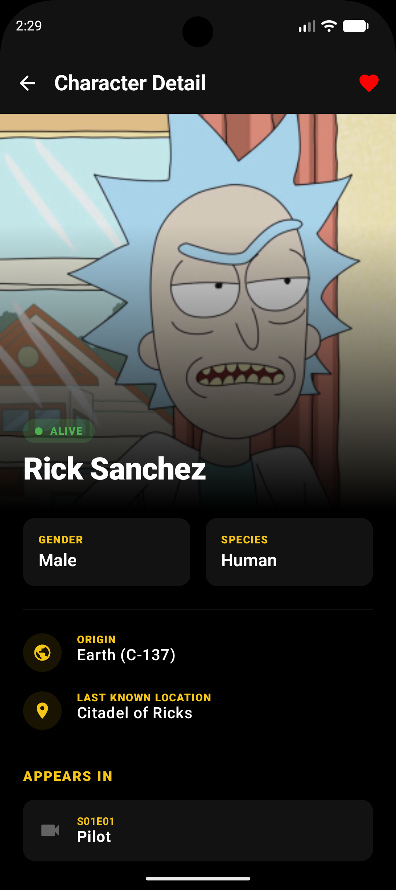
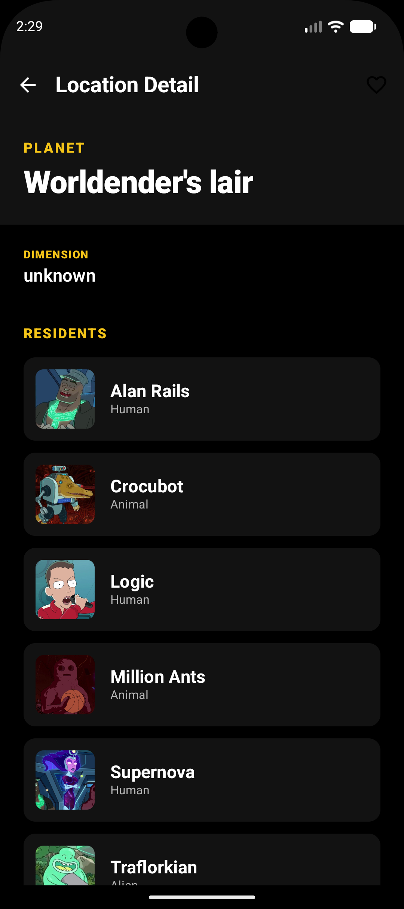

# Rick & Morty Fan App 🛸

A modern, adaptive Android application for Rick and Morty enthusiasts, built with Jetpack Compose, Material 3, and Clean Architecture.

## Features ✨

- **Adaptive Layouts:** Supports various screen sizes using `NavigationSuiteScaffold` (Bottom Bar for mobile, Navigation Rail for landscape/tablets).
- **Authentication:** Secure user login and signup flow powered by **Firebase Auth**.
- **Characters:** Explore the vast multiverse of Rick and Morty characters with custom infinite scroll.
- **Locations:** Discover all the weird and wonderful places in the show with infinite scroll.
- **Episodes:** Browse through all seasons and episodes with infinite scroll.
- **Favorites:** Save your favorite characters, locations, and episodes for quick access.
- **Profile:** Manage your user profile and settings with a polished Material 3 UI.
- **Performance:** Optimized for speed and smoothness using **Baseline Profiles**.

## Architecture 🏗️

The project is built following **Clean Architecture** principles and the **MVVM (Model-View-ViewModel)** pattern to ensure scalability, maintainability, and testability.

### Layers:
- **Domain Layer:** The heart of the application. Contains **Entities**, **Repository Interfaces**, and **Use Cases**. It is purely Kotlin/Java and has no dependencies on the Android framework.
- **Data Layer:** Responsible for data retrieval and persistence. Implements the Domain's Repository interfaces using **Retrofit** for network calls and **Room** for local storage.
- **Presentation Layer:** Handles the UI and user interaction. Built with **Jetpack Compose**, it follows the MVVM pattern where ViewModels interact with Use Cases and expose state via Kotlin **Flow** and **Compose State**.

## Multi-Module Architecture 📁

The project is modularized to improve build performance and enforce a clear separation of concerns:
- **`:app`**: The main entry point. Contains the implementation of core features (Characters, Locations, Episodes, Favorites, Profile).
- **`:auth`**: A feature module dedicated to authentication logic, including login and signup screens.
- **`:common`**: A core module providing shared resources, utilities, and base classes used across the entire project.
- **`:benchmark`**: A dedicated module for performance testing using **Macrobenchmark** and **Baseline Profile** generation.

## Tech Stack 🛠️

- **Language:** Kotlin
- **UI:** Jetpack Compose with Material 3 Adaptive Navigation.
- **Dependency Injection:** Hilt (Dagger).
- **Networking:** Retrofit with Gson.
- **Local Database:** Room.
- **Image Loading:** Coil.
- **Navigation:** Type-safe Compose Navigation using Kotlin Serialization.
- **Concurrency:** Kotlin Coroutines & Flow.
- **Firebase:**
    - **Authentication:** User identity management.
    - **Analytics:** Understanding user engagement.
    - **Crashlytics:** Real-time crash reporting.

## Performance Measurement ⚡

The app uses **Jetpack Macrobenchmark** to measure critical user journeys (CUJs) like app startup and list scrolling. We also utilize **Baseline Profiles** to significantly improve app startup time and reduce jank.

To run benchmarks:
1. Ensure you have a rooted device or emulator with API 24+.
2. Run the command: `./gradlew :benchmark:connectedCheck`

## Testing 🧪

The project includes a robust testing suite covering all architectural layers:

- **Unit Tests:**
    - **Tools:** [MockK](https://mockk.io/) for mocking, [Turbine](https://github.com/cashapp/turbine) for testing Flows, and Kotlin Coroutines Test.
    - **Coverage:** ViewModels, Use Cases, and Repositories are thoroughly tested to ensure business logic reliability.
- **Instrumented Tests:**
    - **Tools:** [Compose UI Test](https://developer.android.com/develop/ui/compose/testing) library.
    - **Coverage:** Verified UI components and user interaction flows on actual devices/emulators.
- **Database Tests:**
    - **Coverage:** Room DAO operations are verified using in-memory databases.

## CI/CD Workflow 🚀

The project is configured with **GitHub Actions** for automated quality assurance.

- **Build Automation:** Every push and pull request triggers a full project build.
- **Static Analysis:** Automated **Lint** checks ensure adherence to coding standards.
- **Automated Testing:** All unit tests are executed automatically in the CI environment to prevent regressions.
- **Configuration:** See `.github/workflows/android.yml` for the detailed workflow setup.

## Code Quality ⚙️

To maintain high code quality, run these commands locally before committing your changes:

| Task | Command |
| :--- | :--- |
| **Full Lint Check** | `./gradlew lint` |
| **Unit Tests** | `./gradlew test` |
| **Static Analysis (app)** | `./gradlew :app:lintDebug` |

> **Note:** After running lint, you can find detailed HTML reports in: `[module]/build/reports/lint-results-debug.html`

## API Credit 🔌

All data is provided by [The Rick and Morty API](https://rickandmortyapi.com/).

## Screenshots 📸

  
  
  
   
  
  
  
   
  
  
  

---
Developed with ❤️ by Mukesh
